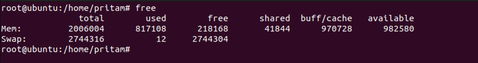
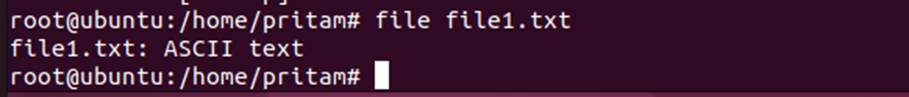

# Assignment no 1 - Linux commands practice

This document provides a quick reference for essential Ubuntu commands categorized into different types.

## Network Commands

### 1. `ifconfig`
    Display network interfaces and their configurations.

### 2. `ping`
    Check network connectivity to a specific host.

### 3. `traceroute`
    Display the route that packets take to reach a destination.

### 4. `netstat`
    Display network statistics and connections.

### 5. `ss`
    Another utility to investigate sockets.

## Process Commands

### 6. `ps`
    Display information about running processes.

### 7. `top`
    Display dynamic real-time information about system processes.

### 8. `kill`
    Terminate a process.

### 9. `killall`
    Kill processes by name.

### 10. `pkill`
    Signal processes based on their name.

## Memory Commands

### 11. `free`
    Display amount of free and used memory.

### 12. `vmstat`
    Report virtual memory statistics.

### 13. `pmap`
    Display memory map of a process.

### 14. `ps aux`
    Displays detailed information about all processes currently running

### 15. `htop`
    Interactive process viewer with system metrics.

## File Commands

### 16. `ls`
    List directory contents.

### 17. `cp`
    Copy files or directories.

### 18. `mv`
    Move or rename files or directories.

### 19. `rm`
    Remove files or directories.

### 20. `touch`
    Create an empty file.

### 21. `cat`
    Concatenate and display the content of files.

### 22. `nano`
    Text editor in the terminal.

### 23. `grep`
    Search for a specific pattern in files.

### 24. `find`
    Search for files and directories.

### 25. `chmod`
    Change file permissions.

### 26. `chown`
    Change file ownership.

### 27. `du`
    Display disk usage of directories.

### 28. `df`
    Display information about disk space usage.

### 29. `ln`
    Create links between files.

### 30. `file`
    Determine file type.

## System Information Commands

### 31. `uname`
    Display system information.

### 32. `lsb_release`
    Display LSB (Linux Standard Base) information.

### 33. `hostname`
    Display or set the system hostname.

### 34. `uptime`
    Display how long the system has been running.

## User Management Commands

### 35. `who`
    Display information about users who are currently logged in.

### 36. `w`
    Display who is logged in and what they are doing.

### 37. `users`
    Display current users.

### 38. `adduser`
    Add a new user.

### 39. `passwd`
    Change user password.

### 40. `usermod`
    Modify user account settings.

## Package Management Commands

### 41. `apt-get`
    Package management tool for Debian-based systems.

### 42. `apt-cache`
    Query the APT cache.

### 43. `dpkg`
    Package manager for Debian-based systems.

### 44. `aptitude`
    High-level interface to the package manager.

### 45. `snap`
    Package manager for snaps.

## System Control Commands

### 46. `systemctl`
    Control the systemd system and service manager.

### 47. `reboot`
    Reboot the system.

### 48. `shutdown`
    Shutdown the system.

### 49. `journalctl`
    Query and display messages from the journal.

### 50. `lsmod`
    Display information about loaded kernel modules.

